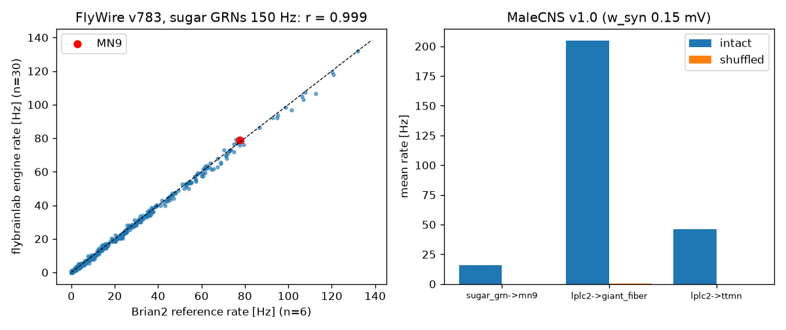
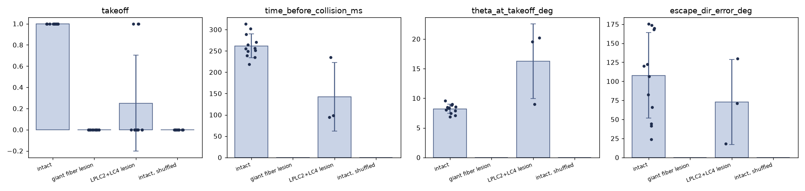
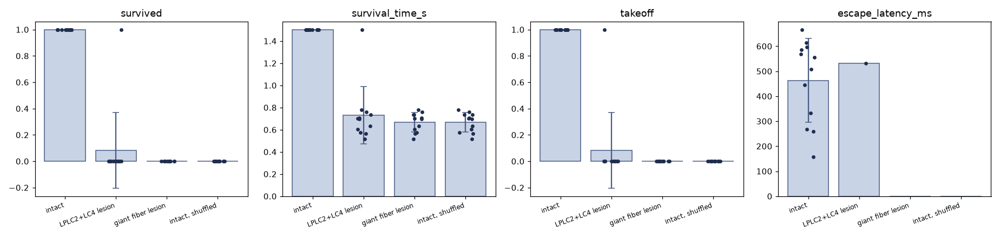
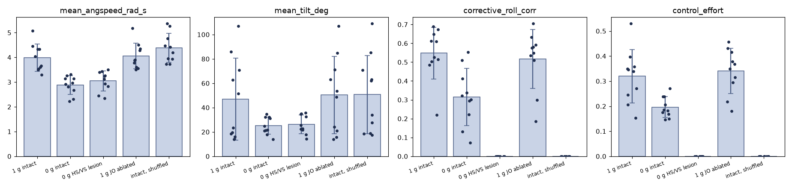
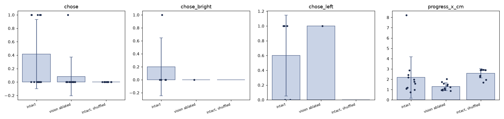
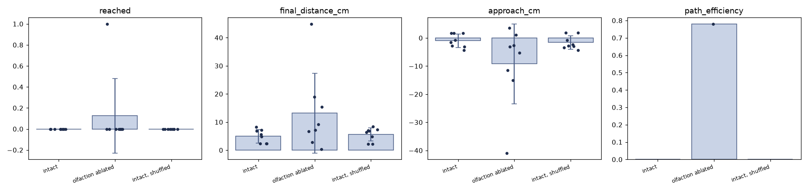

# Ergebnisse der Referenz-Experimente

Automatisch erzeugt von `scripts/make_results_md.py` aus `docs/validation/*.json` und den Runs in `runs/`. Kopien aller hier genannten Runs (Config, Seeds, Metriken pro Trial, Trajektorien) liegen versioniert unter `runs/examples/`.
Werte: Mittelwert ± SD über Seeds (n = gültige Trials). Datensatz: MaleCNS v1.0, Körper `simple`.
Alle Aussagen gelten für **Konnektom + engineered Encoder + handgesetzte Ausleseschicht**.

## M1: Gehirn allein (Shiu-Befund)

| | MN9-Rate [Hz] | aktive Neuronen |
|---|---|---|
| FlyWire v783, Brian2-Referenz (n=6) | 77.5 ± 5.47 | 396 |
| FlyWire v783, diese Engine (n=30) | 78.7 ± 4.82 | 436 |
| FlyWire v783, Shuffle | 0 | |

Korrelation der Raten aller 418 antwortenden Neuronen (Engine vs. Brian2): r = 0.9991.

| MaleCNS v1.0 (w_syn 0,15 mV, n=8) | intakt [Hz] | Shuffle [Hz] |
|---|---|---|
| sugar_grn @ 150 Hz → mn9 | 15.8 ± 2.02 | 0 |
| lplc2 @ 100 Hz → giant_fiber | 205 ± 1.92 | 0.375 |
| lplc2 @ 100 Hz → ttmn | 46.3 ± 0.864 | 0 |

## M3: Looming-Flucht

| Metrik | intact | giant fiber lesion | LPLC2+LC4 lesion | intact, shuffled |
|---|---|---|---|---|
| takeoff | 1 ± 0 (n=12) | 0 ± 0 (n=12) | 0.25 ± 0.452 (n=12) | 0 ± 0 (n=12) |
| time_before_collision_ms | 262 ± 27.8 (n=12) | – (n=0) | 142 ± 80.3 (n=3) | – (n=0) |
| theta_at_takeoff_deg | 8.21 ± 0.789 (n=12) | – (n=0) | 16.2 ± 6.28 (n=3) | – (n=0) |
| escape_dir_error_deg | 108 ± 56.1 (n=12) | – (n=0) | 72.9 ± 55.7 (n=3) | – (n=0) |
| gf_spikes | 11.8 ± 10.7 (n=12) | 0 ± 0 (n=12) | 0.333 ± 0.651 (n=12) | 0 ± 0 (n=12) |

Tests (gegen *intact*; Fisher exakt für binäre Metriken, sonst Welch-t; p nach Holm über die Metriken):

- intact vs. shuffle: takeoff: p=1.48e-06; gf_spikes: p=0.00273
- intact vs. giant fiber lesion: takeoff: p=1.48e-06; gf_spikes: p=0.00273
- intact vs. LPLC2+LC4 lesion: takeoff: p=0.00168; time_before_collision_ms: p=0.357; theta_at_takeoff_deg: p=0.357; escape_dir_error_deg: p=0.403; gf_spikes: p=0.0132

Runs: `20261003-165930_looming_6e9d3f`, `20261003-170013_looming_8ce6f6`, `20261003-170102_looming_35655d`, `20261003-165930_looming_6e9d3f_shuffle`

## M4: Spinne

| Metrik | intact | LPLC2+LC4 lesion | giant fiber lesion | intact, shuffled |
|---|---|---|---|---|
| survived | 1 ± 0 (n=12) | 0.0833 ± 0.289 (n=12) | 0 ± 0 (n=12) | 0 ± 0 (n=12) |
| survival_time_s | 1.5 ± 2.32e-16 (n=12) | 0.731 ± 0.256 (n=12) | 0.667 ± 0.0866 (n=12) | 0.667 ± 0.0866 (n=12) |
| takeoff | 1 ± 0 (n=12) | 0.0833 ± 0.289 (n=12) | 0 ± 0 (n=12) | 0 ± 0 (n=12) |
| escape_latency_ms | 463 ± 167 (n=12) | 532 ± 0 (n=1) | – (n=0) | – (n=0) |
| escape_dir_error_deg | 68.3 ± 50.5 (n=12) | 21 ± 0 (n=1) | – (n=0) | – (n=0) |

Tests (gegen *intact*; Fisher exakt für binäre Metriken, sonst Welch-t; p nach Holm über die Metriken):

- intact vs. shuffle: survived: p=1.48e-06; survival_time_s: p=6.38e-12; takeoff: p=1.48e-06
- intact vs. LPLC2+LC4 lesion: survived: p=1.92e-05; survival_time_s: p=1.5e-06; takeoff: p=1.92e-05
- intact vs. giant fiber lesion: survived: p=1.48e-06; survival_time_s: p=6.38e-12; takeoff: p=1.48e-06

Runs: `20261003-170152_spider_84d162`, `20261003-170330_spider_350101`, `20261003-170435_spider_085bdc`, `20261003-170152_spider_84d162_shuffle`

## M6: Schwerelosigkeit (Luft bleibt)

| Metrik | 1 g intact | 0 g intact | 0 g HS/VS lesion | 1 g JO ablated | intact, shuffled |
|---|---|---|---|---|---|
| mean_angspeed_rad_s | 3.98 ± 0.557 (n=10) | 2.88 ± 0.379 (n=10) | 3.05 ± 0.406 (n=10) | 4.06 ± 0.525 (n=10) | 4.38 ± 0.592 (n=10) |
| mean_tilt_deg | 47 ± 33.6 (n=10) | 25.1 ± 7.08 (n=10) | 26.2 ± 7.79 (n=10) | 50.3 ± 31.8 (n=10) | 50.7 ± 32 (n=10) |
| corrective_roll_corr | 0.548 ± 0.137 (n=10) | 0.315 ± 0.152 (n=10) | 0 ± 0 (n=10) | 0.516 ± 0.156 (n=10) | 0 ± 0 (n=10) |
| control_effort | 0.319 ± 0.106 (n=10) | 0.196 ± 0.0413 (n=10) | 0 ± 0 (n=10) | 0.341 ± 0.0902 (n=10) | 0 ± 0 (n=10) |
| corrective_yaw_corr | 0.0564 ± 0.136 (n=10) | 0.0274 ± 0.0601 (n=10) | 0 ± 0 (n=10) | 0.0428 ± 0.14 (n=10) | 0 ± 0 (n=10) |
| drift_cm | 107 ± 53.5 (n=10) | 205 ± 1.35 (n=10) | 205 ± 1.53 (n=10) | 111 ± 52.9 (n=10) | 111 ± 50.6 (n=10) |
| upright_fraction | 0.6 ± 0.296 (n=10) | 0.598 ± 0.297 (n=10) | 0.565 ± 0.311 (n=10) | 0.552 ± 0.271 (n=10) | 0.53 ± 0.243 (n=10) |

Tests (gegen *intact*; Fisher exakt für binäre Metriken, sonst Welch-t; p nach Holm über die Metriken):

- intact vs. shuffle: mean_angspeed_rad_s: p=0.7; mean_tilt_deg: p=1; corrective_roll_corr: p=3.48e-06; control_effort: p=3.25e-05; corrective_yaw_corr: p=0.891; drift_cm: p=1; upright_fraction: p=1
- intact vs. 0 g intact: mean_angspeed_rad_s: p=0.000629; mean_tilt_deg: p=0.216; corrective_roll_corr: p=0.0105; control_effort: p=0.0212; corrective_yaw_corr: p=1; drift_cm: p=0.00153; upright_fraction: p=1
- intact vs. 0 g HS/VS lesion: mean_angspeed_rad_s: p=0.00213; mean_tilt_deg: p=0.259; corrective_roll_corr: p=3.48e-06; control_effort: p=3.25e-05; corrective_yaw_corr: p=0.446; drift_cm: p=0.00131; upright_fraction: p=0.798
- intact vs. 1 g JO ablated: mean_angspeed_rad_s: p=1; mean_tilt_deg: p=1; corrective_roll_corr: p=1; control_effort: p=1; corrective_yaw_corr: p=1; drift_cm: p=1; upright_fraction: p=1

Runs: `20261003-170537_zerog_b81a55`, `20261003-170640_zerog_582a29`, `20261003-170741_zerog_1eb7ac`, `20261003-170848_zerog_b28f6e`, `20261003-170537_zerog_b81a55_shuffle`

## M7: Lichtwahl (T-Labyrinth)

| Metrik | intact | vision ablated | intact, shuffled |
|---|---|---|---|
| chose | 0.417 ± 0.515 (n=12) | 0.0833 ± 0.289 (n=12) | 0 ± 0 (n=12) |
| chose_bright | 0.2 ± 0.447 (n=5) | 0 ± 0 (n=1) | – (n=0) |
| chose_left | 0.6 ± 0.548 (n=5) | 1 ± 0 (n=1) | – (n=0) |
| progress_x_cm | 2.18 ± 2.01 (n=12) | 1.28 ± 0.372 (n=12) | 2.58 ± 0.441 (n=12) |

Tests (gegen *intact*; Fisher exakt für binäre Metriken, sonst Welch-t; p nach Holm über die Metriken):

- intact vs. shuffle: chose: p=0.0745; progress_x_cm: p=0.517
- intact vs. vision ablated: chose: p=0.306; progress_x_cm: p=0.306

Runs: `20261003-163816_lightchoice_11d604`, `20261003-164426_lightchoice_704eae`, `20261003-163816_lightchoice_11d604_shuffle`

## M7: Futtersuche (Duft)

| Metrik | intact | olfaction ablated | intact, shuffled |
|---|---|---|---|
| reached | 0 ± 0 (n=8) | 0.125 ± 0.354 (n=8) | 0 ± 0 (n=8) |
| final_distance_cm | 4.96 ± 2.41 (n=8) | 13.2 ± 14.2 (n=8) | 5.62 ± 2.35 (n=8) |
| approach_cm | -0.962 ± 2.41 (n=8) | -9.2 ± 14.2 (n=8) | -1.62 ± 2.35 (n=8) |
| path_efficiency | – (n=0) | 0.779 ± 0 (n=1) | – (n=0) |

Tests (gegen *intact*; Fisher exakt für binäre Metriken, sonst Welch-t; p nach Holm über die Metriken):

- intact vs. shuffle: reached: p=1; final_distance_cm: p=1; approach_cm: p=1
- intact vs. olfaction ablated: reached: p=1; final_distance_cm: p=0.442; approach_cm: p=0.442

Runs: `20261003-164910_foraging_77dcf3`, `20261003-165310_foraging_d86e4f`, `20261003-164910_foraging_77dcf3_shuffle`

## Trainierte Ausleseschicht: Sprungrichtung

Ridge-Regression von 1314 Descending Neurons (gefilterte Rate beim Giant-Fiber-Trigger) auf die Fluchtrichtung, 24 Azimute × 2 Seeds, Leave-one-azimuth-out-Kreuzvalidierung.

| Konnektom | aktive DNs | Abheben ausgelöst | mittl. Winkelfehler (CV) | Median |
|---|---|---|---|---|
| intact | 27 | 1 | 53.6° | 41.8° |
| shuffled | 7 | 0 | 69° | 62.1° |
| Zufall | | | 90° | |

Im geschlossenen Loop (Looming, gleiche 12 Seeds, Azimute nicht im Training):

| Ausleseschicht | escape_dir_error_deg |
|---|---|
| handgesetzt (DNp02/DNp11 L−R) | 108 ± 56.1 (n=12) |
| trainiert (Ridge, alle DNs) | 48.3 ± 27.5 (n=12) |

Welch-t p = 0.00453. Runs: `20261003-165930_looming_6e9d3f`, `20261003-171002_looming_f7ded6`. Berichte dazu müssen "Konnektom + trainierte Ausleseschicht" sagen.
